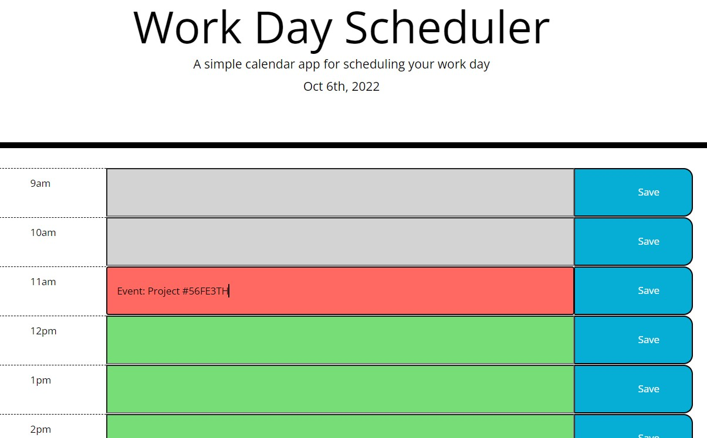

# Module-5-Challenge

Third-Party APIs: Work Day Scheduler

## Installation

    Tools used to create page
        Visual Studio Code
        GitHub
        Git Bash
        Google Chrome
        Moment js

## User Story

AS AN employee with a busy schedule

I WANT to add important events to a daily planner
SO THAT I can manage my time effectively

## Acceptance Criteria 
GIVEN I am using a daily planner to create a schedule
    7% Each -14%
    Complete: 
    WHEN I open the planner
    THEN the current day is displayed at the top of the calendar
    Complete:
    WHEN I scroll down
    THEN I am presented with time blocks for standard business hours
    Complete:
    WHEN I view the time blocks for that day
    THEN each time block is color-coded to indicate whether it is in the past, present, or future
    Complete:
    WHEN I click into a time block
    THEN I can enter an event
    TODO:
    WHEN I click the save button for that time block
    THEN the text for that event is saved in local storage
    TODO:
    WHEN I refresh the page
    THEN the saved events persist

    